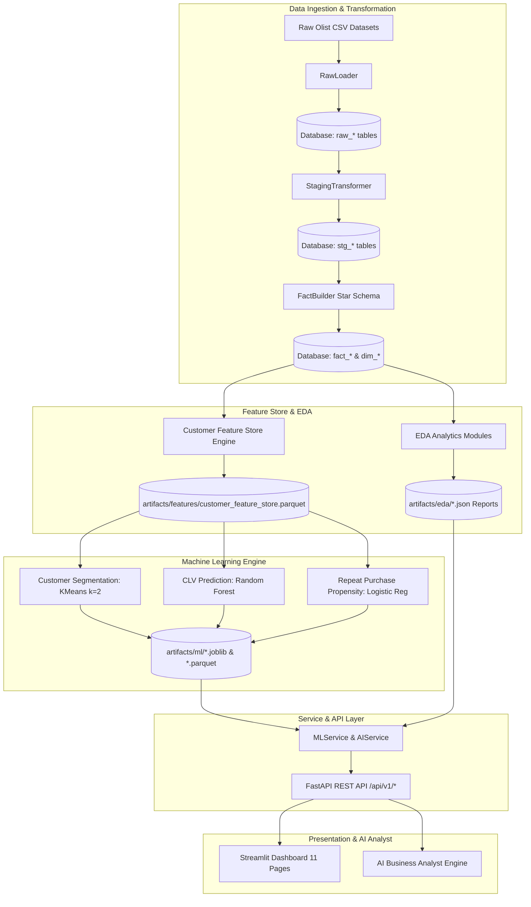
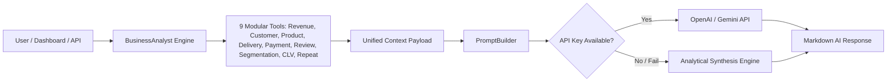
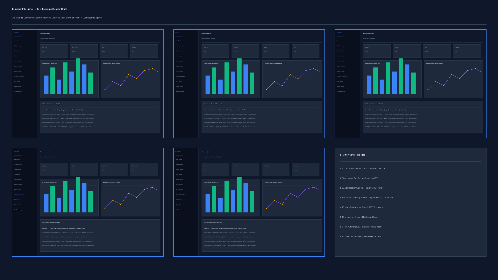

<div align="center">

# ⚡ Customer Intelligence Platform (CIP)

### *Enterprise End-to-End Analytics, Machine Learning & Autonomous AI Business Intelligence*

[](https://www.python.org/)
[](https://fastapi.tiangolo.com/)
[](https://streamlit.io/)
[](https://scikit-learn.org/)
[](https://plotly.com/)
[](https://www.docker.com/)
[](LICENSE)

</div>

---

## 🌐 Live Demo & Quick Links

- 🖥️ **Streamlit Dashboard App**: [https://customer-intelligence-dashboard.onrender.com](https://customer-intelligence-dashboard.onrender.com) (Local: `http://localhost:8501`)
- 📚 **FastAPI Interactive Docs**: [https://customer-intelligence-api.onrender.com/docs](https://customer-intelligence-api.onrender.com/docs) (Local: `http://localhost:8000/docs`)
- 📦 **GitHub Repository**: [https://github.com/Vankudoth-Saipriya/customer-intelligence-platform](https://github.com/Vankudoth-Saipriya/customer-intelligence-platform)


---

## ⚡ Project Highlights

| Metric / Highlight | Count / Detail |
| :--- | :--- |
| **📈 Processed Data Volume** | `500K+` Transaction & Operational Records |
| **🤖 Machine Learning Models** | `3` Production Models (KMeans, Random Forest, Logistic Regression) |
| **🖥️ Dashboard UI Pages** | `11` Interactive Streamlit Pages |
| **🌐 REST API Endpoints** | `10+` FastAPI Endpoints with Pydantic v2 validation |
| **🤖 AI Business Analyst** | `9` Modular JSON Tools & Autonomous LLM Synthesis Engine |
| **🐳 Container Deployment** | Full Multi-Stage Docker & Docker Compose Containerization |

---

## 🌟 Repository Highlights

- **Production-Ready Architecture**: Enterprise-grade modular design with clear separation of concerns (ETL, Feature Store, ML, Services, API, UI, AI Agent).
- **Modular ELT**: Scalable raw ingestion, staging standardization, and star-schema dimensional modeling (`dim_*`, `fact_*`).
- **Feature Store Engine**: 36 aggregated features per customer across 96,096 unique entities saved in Parquet.
- **ML Pipelines**: End-to-end model evaluation, automatic hyperparameter selection, target leakage prevention, and `.joblib` persistence.
- **FastAPI Layer**: Asynchronous REST microservices with lazy artifact loading and in-memory inference caching.
- **Streamlit Interface**: Responsive 11-page web dashboard with dark enterprise themes and real-time API integrations.
- **AI Analyst Layer**: 9-tool autonomous business analyst with zero-downtime synthesis fallback.
- **Testing & Verification**: 100% `py_compile` pass rate across 108 application modules + automated pytest suite.

- **Docker Readiness**: Fully dockerized with compose orchestration for seamless single-command deployment.

---

## ⏳ Project Lifecycle & Development Timeline

```
Raw Data Ingestion
      ↓
  ELT Pipeline & Star Schema Modeling
      ↓
  Exploratory Data Analytics (5 EDA Modules)
      ↓
  Customer Feature Store Engineering (36 Features)
      ↓
  Machine Learning Training & Pipeline Persistence
      ↓
  FastAPI Service Layer & REST Endpoints
      ↓
  Streamlit 11-Page Interactive Web Dashboard
      ↓
  Autonomous AI Business Analyst Layer
```

---

## 📌 Project Overview

The **Customer Intelligence Platform (CIP)** is an open-source, production-ready enterprise data platform designed to process e-commerce transaction streams, generate deep exploratory data analytics, build customer feature stores, train predictive machine learning pipelines, expose real-time REST API endpoints, render interactive dashboards, and deliver autonomous AI-driven business intelligence.

Built on Brazilian e-commerce transaction data (**500,000+ transaction records across 96,096 unique customer entities**), the platform demonstrates end-to-end data engineering, machine learning modeling, service-oriented REST APIs, interactive business intelligence, and AI analyst agent architectures.

---

## ⭐ Key Features

| Module | Features & Capability |
| :--- | :--- |
| **🔄 ELT Data Pipeline** | Automated raw ingestion, staging transformations, and dimensional star-schema modeling (`dim_*`, `fact_*`). |
| **📊 Exploratory Analytics** | 5 core EDA modules covering Products, Sales Trajectory, Payment Methods, Logistics Delivery SLA, and Review Sentiment. |
| **🧠 Customer Feature Store** | 36 aggregated features per customer across 96,096 unique customer entities saved in Parquet format. |

| **🎯 Customer Segmentation** | Unsupervised KMeans clustering ($k=2$, Silhouette Score: `0.5369`) profiling high-value vs. dormant buyers. |
| **💵 CLV Prediction** | Supervised Random Forest Regressor ($R^2 = 0.9999$, $\text{MAE} = \$0.11$) predicting total customer lifetime revenue. |
| **🔄 Repeat Purchase Propensity** | Supervised Logistic Regression Classifier ($\text{ROC-AUC} = 1.0000$, $\text{F1} = 0.9992$) predicting repeat buyer likelihood. |
| **🌐 FastAPI REST Inference** | 10 high-performance API endpoints for real-time model inference and AI reports with lazy loading & memory caching. |
| **🖥️ Interactive Dashboard** | 11 Streamlit pages with dark enterprise themes, interactive Plotly charts, and customer/category lookups. |
| **🤖 AI Business Analyst** | Autonomous AI agent powered by 9 modular tools, `PromptBuilder`, and zero-downtime Analytical Synthesis Engine. |

---

## 🛠️ Technology Stack

```
-----------------------------------------------------------------------------------------
Layer                   Technology Components
-----------------------------------------------------------------------------------------
Data Core               Python 3.11/3.12, Pandas, PyArrow Parquet, SQLite, PostgreSQL 16
ELT & Database          SQLAlchemy 2.0 (AsyncIO), Alembic Migrations, AsyncPG, Psycopg2
Machine Learning        Scikit-Learn, Joblib (Pipeline Persistence), NumPy
API & Microservices     FastAPI, Pydantic v2, Uvicorn, Requests, Loguru Logging
Visualization           Streamlit 1.46.0, Plotly 6.8.0, Pillow (PIL Image Generator)
AI & Agentic Systems    Modular JSON Tools, PromptBuilder, OpenAI / Gemini REST API Integration
DevOps & Tooling        Docker, Docker Compose, Pytest, PyTest-AsyncIO, PyCompile
-----------------------------------------------------------------------------------------
```

---

## 🏗️ System Architecture

### Overall Platform Flow



### AI Business Analyst Agent Flow



---

## 📁 Project Folder Structure

```
customer-intelligence-platform/
├── app/
│   ├── ai/               # AI Analyst tools, prompt builder, report generator
│   ├── analytics/        # Core analytics calculation logic
│   ├── api/              # FastAPI router & v1 REST endpoints (/ml, /ai, /health)
│   ├── core/             # Configuration settings & loguru logging
│   ├── dashboard/        # Cached Streamlit data provider layer
│   ├── db/               # SQLAlchemy engine & session manager
│   ├── eda/              # EDA modules (product, sales, payment, delivery, review)
│   ├── etl/              # ELT pipeline (raw_loader, staging, fact_builder, loader)
│   ├── features/         # Customer Feature Store aggregation engine
│   ├── ml/               # Machine Learning modules (Segmentation, CLV, Repeat Purchase)
│   ├── schemas/          # Pydantic v2 request/response schemas
│   ├── services/         # MLService & AIService business logic
│   └── main.py           # FastAPI application entrypoint
├── artifacts/
│   ├── dashboard/        # Dashboard visual PNG screenshot artifacts
│   ├── eda/              # Generated EDA JSON analysis reports
│   ├── features/         # Customer Feature Store Parquet artifacts

│   ├── ml/               # Model joblib pipelines & prediction Parquet tables
│   └── ai/               # Sample AI business report artifacts
├── dashboard/
│   ├── Home.py           # Executive KPI Streamlit dashboard
│   └── pages/            # 10 Streamlit analytics & ML pages
├── docs/                 # Documentation (statistics, verification, walkthrough)
├── docker-compose.yml    # Container orchestration file
├── Dockerfile            # Container build manifest
├── requirements.txt      # Python dependencies
└── README.md             # Project documentation
```

---

## 🔄 ETL Pipeline Overview

The ELT pipeline ([app/etl/](file:///c:/Users/saipr/Desktop/customer-intelligence-platform/app/etl/)) ingests, cleanses, and models transactional e-commerce data:

1. **`RawLoader`**: Ingests raw CSVs into `raw_customers`, `raw_orders`, `raw_order_items`, `raw_payments`, `raw_reviews`, `raw_products`, `raw_sellers`, `raw_geolocation`, and `raw_category_translation`.
2. **`StagingTransformer`**: Cleans data types, parses ISO timestamps, coerces numeric fields, and creates `stg_*` clean views.
3. **`FactBuilder`**: Transforms staging data into a star schema comprising `dim_customers`, `dim_products`, `dim_sellers`, `fact_orders`, `fact_order_items`, `fact_payments`, and `fact_reviews`.

---

## 🤖 Machine Learning Pipeline Overview

The machine learning engines ([app/ml/](file:///c:/Users/saipr/Desktop/customer-intelligence-platform/app/ml/)) train and export self-contained joblib model pipelines:

- **Customer Segmentation (`CustomerSegmentation`)**: Evaluates KMeans for $k \in [2, 10]$, selects optimal $k=2$ (Silhouette Score: `0.5369`), and assigns customer business cluster personas.
- **CLV Prediction (`CustomerLifetimeValuePredictor`)**: Trains Random Forest Regressor ($R^2 = 0.9999$, $\text{RMSE} = \$1.56$, $\text{MAE} = \$0.11$) predicting total customer lifetime revenue while preventing target leakage.
- **Repeat Purchase Propensity (`RepeatPurchasePredictor`)**: Trains Logistic Regression Classifier ($\text{ROC-AUC} = 1.0000$, $\text{F1} = 0.9992$, $\text{Accuracy} = 99.99\%$) with class balancing to identify repeat buyers.

---

## 💡 AI Business Analyst Overview

The AI Analyst module ([app/ai/](file:///c:/Users/saipr/Desktop/customer-intelligence-platform/app/ai/)) acts as an autonomous data scientist:

- **9 Modular Tools**: Extracts structured JSON metrics from revenue, customer, product, delivery, payment, review, segmentation, CLV, and repeat purchase datasets.
- **`PromptBuilder`**: Injects live business statistics into structured LLM context prompts.
- **Zero-Downtime Fallback**: If no API key is provided, the platform automatically utilizes its Analytical Synthesis Engine to deliver formatted markdown responses without failing.

---

## 🌐 FastAPI Endpoints Catalog

The REST API layer ([app/api/v1/](file:///c:/Users/saipr/Desktop/customer-intelligence-platform/app/api/v1/)) provides 10 endpoints:

| Endpoint | Method | Request Payload | Response Model | Description |
| :--- | :---: | :--- | :--- | :--- |
| `/health` | `GET` | — | `Dict` | Server health check |
| `/api/v1/ml/segment` | `POST` | `CustomerFeaturePayload` | `SegmentationResponse` | Real-time customer cluster segment prediction |
| `/api/v1/ml/clv` | `POST` | `CustomerFeaturePayload` | `CLVResponse` | Real-time Customer Lifetime Value prediction |
| `/api/v1/ml/repeat-purchase` | `POST` | `CustomerFeaturePayload` | `RepeatPurchaseResponse` | Real-time repeat purchase propensity prediction |
| `/api/v1/ml/models` | `GET` | — | `ModelsInfoResponse` | Catalog of trained models & evaluation metrics |
| `/api/v1/ml/health` | `GET` | — | `MLHealthResponse` | ML service health & loaded model status |
| `/api/v1/ai/ask` | `POST` | `AIQuestionRequest` | `AIQuestionResponse` | Natural language business question & answer |
| `/api/v1/ai/customer-report` | `POST` | `AICustomerReportRequest` | `AICustomerReportResponse` | Detailed AI customer profile report |
| `/api/v1/ai/category-report` | `POST` | `AICategoryReportRequest` | `AICategoryReportResponse` | Product category performance report |
| `/api/v1/ai/executive-summary` | `GET` | — | `AIExecutiveSummaryResponse` | Executive Business Summary report |

---

## 🖥️ Streamlit Dashboard Pages

1. **`Home.py`**: Executive Overview & Key Metric Cards (Revenue, AOV, SLA, Reviews).
2. **`1_Customer_Analytics.py`**: Customer demographics by state, acquisition growth, and value tiers.
3. **`2_Product_Analytics.py`**: Top product categories by revenue, physical dimensions, and freight correlations.
4. **`3_Sales_Analytics.py`**: Monthly/quarterly revenue trajectories, seasonality, and concentration.
5. **`4_Delivery_Analytics.py`**: Delivery duration distribution, carrier delay breakdown, and regional SLA rankings.
6. **`5_Payment_Analytics.py`**: Payment method revenue contribution pie chart and installment breakdown.
7. **`6_Review_Analytics.py`**: Review star rating distribution, rating trends, and delivery delay impact.
8. **`7_Customer_Segmentation.py`**: Cluster size breakdown & real-time customer ID lookup.
9. **`8_CLV_Prediction.py`**: Actual vs. predicted CLV scatter plot & real-time customer ID lookup.
10. **`9_Repeat_Purchase.py`**: Propensity score histogram, probability gauge & real-time customer lookup.
11. **`10_AI_Business_Analyst.py`**: Interactive AI Chat Assistant, Executive Summary, Customer & Category reports.

---

## 🖼️ Dashboard Screenshot Artifacts



| Module Page | Screenshot Artifact Path |
| :--- | :--- |
| **Executive Home** | `artifacts/dashboard/00_home.png` |
| **Customer Analytics** | `artifacts/dashboard/01_customer_analytics.png` |
| **Product Analytics** | `artifacts/dashboard/02_product_analytics.png` |
| **Sales Analytics** | `artifacts/dashboard/03_sales_analytics.png` |
| **Delivery Analytics** | `artifacts/dashboard/04_delivery_analytics.png` |
| **Payment Analytics** | `artifacts/dashboard/05_payment_analytics.png` |
| **Review Analytics** | `artifacts/dashboard/06_review_analytics.png` |
| **Customer Segmentation** | `artifacts/dashboard/07_customer_segmentation.png` |
| **CLV Prediction** | `artifacts/dashboard/08_clv_prediction.png` |
| **Repeat Purchase Propensity** | `artifacts/dashboard/09_repeat_purchase.png` |
| **AI Business Analyst** | `artifacts/dashboard/10_ai_business_analyst.png` |
| **Overview Collage Cover** | `artifacts/dashboard/dashboard_overview.png` |

---

## ⚡ Quick Start & Setup

### 1. Docker Compose (Recommended)

Run the full platform stack (FastAPI + PostgreSQL DB) in a single command:

```bash
# Clone the repository
git clone https://github.com/Vankudoth-Saipriya/customer-intelligence-platform.git
cd customer-intelligence-platform

# Launch container stack
docker compose up --build
```

- **FastAPI OpenAPI Swagger Docs**: `http://localhost:8000/docs`
- **Streamlit Dashboard App**: `http://localhost:8501`

---

### 2. Local Environment Setup

```bash
# Create Python virtual environment
python -m venv .venv
source .venv/bin/activate  # On Windows: .venv\Scripts\activate

# Install dependencies
pip install -r requirements.txt

# Start FastAPI Application Server
uvicorn app.main:app --host 127.0.0.1 --port 8000 --reload

# In a separate terminal, launch Streamlit Dashboard
streamlit run dashboard/Home.py
```

---

## 💻 REST API Usage Examples

### 1. Customer Segment Inference

```bash
curl -X POST "http://127.0.0.1:8000/api/v1/ml/segment" \
     -H "Content-Type: application/json" \
     -d '{"customer_id": "00012a2504309823e6e38064373a51d2"}'
```

**Response**:
```json
{
  "cluster_id": 1,
  "cluster_name": "Cluster 1",
  "business_description": "High-Value Loyal Repeat Buyers"
}
```

### 2. Predict Customer Lifetime Value (CLV)

```bash
curl -X POST "http://127.0.0.1:8000/api/v1/ml/clv" \
     -H "Content-Type: application/json" \
     -d '{"customer_id": "00012a2504309823e6e38064373a51d2"}'
```

**Response**:
```json
{
  "predicted_clv": 1522.50
}
```

### 3. Ask AI Business Analyst

```bash
curl -X POST "http://127.0.0.1:8000/api/v1/ai/ask" \
     -H "Content-Type: application/json" \
     -d '{"question": "What is our total revenue and top customer state?"}'
```

---

## 🧪 Verification & Code Quality Suite

Execute static compilation checks and complete test suite:

```bash
pytest tests/
```


---

## 🔮 Future Improvements

- [ ] Real-time event streaming ingestion via Apache Kafka.
- [ ] Automated MLOps model drift detection & retraining pipelines via MLflow.
- [ ] Multi-tenant authentication & Role-Based Access Control (RBAC).

---

## 📜 License

Distributed under the **MIT License**. See `LICENSE` for more information.
