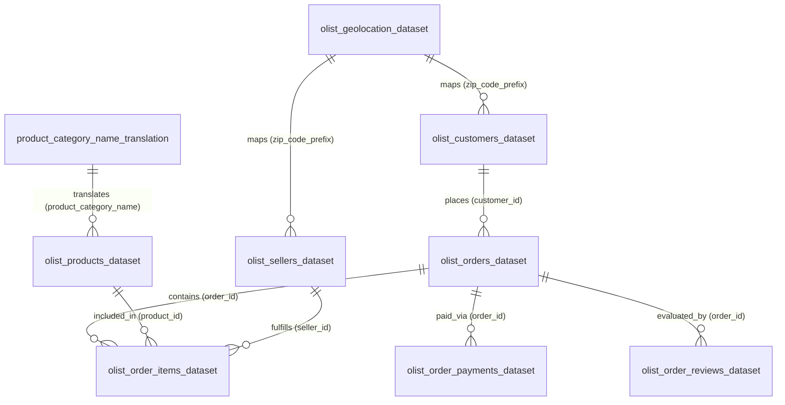

# Data Understanding Document - Customer Intelligence Platform

## Executive Summary

This document provides a comprehensive data audit and architectural evaluation of the Brazilian E-Commerce Public Dataset by Olist, located in `data/raw`. The dataset encompasses 100,000+ e-commerce orders placed between 2016 and 2018 across multiple marketplaces in Brazil. 

The analysis evaluates all **9 raw CSV datasets**, detailing schema specifications, data quality, integrity constraints, and downstream utility for four core analytics & ML modules:
1. **Customer Segmentation**
2. **Customer Lifetime Value (CLV) Prediction**
3. **Churn Prediction**
4. **Executive Dashboard**

---

## Data Architecture & Entity Relationship Diagram

---

## Comprehensive Table-by-Table Analysis

### 1. `olist_customers_dataset.csv`

#### Purpose
Stores customer demographic locations and maps per-order customer identifiers (`customer_id`) to persistent unique customer identities (`customer_unique_id`).

#### Number of Rows and Columns
- **Rows:** 99,441
- **Columns:** 5

#### Primary Key
- `customer_id` (Unique per order; 99,441 unique values)

#### Foreign Keys
- `customer_zip_code_prefix` $\rightarrow$ `olist_geolocation_dataset.geolocation_zip_code_prefix`

#### Column Descriptions
| Column Name | Data Type | Null Count | Null % | Description |
| :--- | :--- | :--- | :--- | :--- |
| `customer_id` | String (Object) | 0 | 0.00% | Key to the orders dataset. Each order is assigned a unique `customer_id`. |
| `customer_unique_id` | String (Object) | 0 | 0.00% | Persistent identifier of the actual customer across multiple repeat orders. |
| `customer_zip_code_prefix` | Integer (int64) | 0 | 0.00% | First 5 digits of the customer's Brazilian zip code. |
| `customer_city` | String (Object) | 0 | 0.00% | Customer city name. |
| `customer_state` | String (Object) | 0 | 0.00% | Customer state 2-letter abbreviation (e.g., SP, RJ, MG). |

#### Relationships with Other Tables
- **1-to-1** with `olist_orders_dataset` via `customer_id`.
- **Many-to-1** mapping from `customer_id` to `customer_unique_id` (one physical customer can place multiple orders).
- **Many-to-1** with `olist_geolocation_dataset` via `customer_zip_code_prefix`.

#### Missing Values
- **0 missing values** across all columns.

#### Duplicate Considerations
- **0 duplicate rows.**
- `customer_id` is 100% unique.
- `customer_unique_id` contains **96,096 unique values** across 99,441 records, revealing 3,345 repeat purchase transactions by existing customers.

#### Data Quality Concerns
- Zip code prefix is stored as an integer, which strips leading zeros for zip codes starting with zero (e.g., São Paulo prefixes starting with `0`). Formatting padding is required during ETL.
- City names are unstandardized strings and contain minor casing/accent discrepancies when compared against the geolocation dataset.

#### Business Value
Essential for tracking customer behavior over time, identifying repeat purchasers, assessing geographic market concentration, and calculating regional delivery performance.

#### Future Module Usage
- **Customer Segmentation:** Core entity table for building RFM (Recency, Frequency, Monetary) metrics grouped by `customer_unique_id` and regional demographic clusters.
- **CLV Prediction:** Critical for tracking historical purchase counts and multi-year transaction trajectories per `customer_unique_id`.
- **Churn Prediction:** Defines the primary customer unit for calculating recency gaps between purchases and determining churn status.
- **Executive Dashboard:** Supplies demographic filters, regional customer concentration maps, and customer acquisition counts.

---

### 2. `olist_geolocation_dataset.csv`

#### Purpose
Provides geographic coordinates (latitude and longitude) associated with Brazilian 5-digit zip code prefixes for distance and spatial logistics analysis.

#### Number of Rows and Columns
- **Rows:** 1,000,163
- **Columns:** 5

#### Primary Key
- None. (Composite surrogate key candidate: `(geolocation_zip_code_prefix, geolocation_lat, geolocation_lng)`).

#### Foreign Keys
- `geolocation_zip_code_prefix` referenced by `olist_customers_dataset.customer_zip_code_prefix` and `olist_sellers_dataset.seller_zip_code_prefix`.

#### Column Descriptions
| Column Name | Data Type | Null Count | Null % | Description |
| :--- | :--- | :--- | :--- | :--- |
| `geolocation_zip_code_prefix` | Integer (int64) | 0 | 0.00% | First 5 digits of Brazilian zip code. |
| `geolocation_lat` | Float (float64) | 0 | 0.00% | Latitude coordinate. |
| `geolocation_lng` | Float (float64) | 0 | 0.00% | Longitude coordinate. |
| `geolocation_city` | String (Object) | 0 | 0.00% | City name associated with coordinates. |
| `geolocation_state` | String (Object) | 0 | 0.00% | State 2-letter code. |

#### Relationships with Other Tables
- **1-to-Many** with `olist_customers_dataset` via `geolocation_zip_code_prefix`.
- **1-to-Many** with `olist_sellers_dataset` via `geolocation_zip_code_prefix`.

#### Missing Values
- **0 missing values** across all columns.

#### Duplicate Considerations
- **261,831 exact duplicate rows.**
- Contains **19,015 unique zip code prefixes** out of 1M+ rows. A single zip code prefix maps to multiple lat/lng points due to sampling across multiple street locations within that prefix.
- Deduplication strategy: Aggregate coordinates to compute mean/median lat and lng per `geolocation_zip_code_prefix` before joins.

#### Data Quality Concerns
- Significant coordinate noise and outliers (e.g., latitude/longitude values falling outside Brazilian land boundaries or into oceans).
- Inconsistent city name spellings and special characters across entries for the same zip code prefix.

#### Business Value
Enables precise calculation of geodesic distances between sellers and buyers, route optimization, shipping cost validation, and spatial coverage modeling.

#### Future Module Usage
- **Customer Segmentation:** Spatial clustering of customers based on lat/lng coordinates.
- **CLV Prediction:** Indirect feature for shipping distance impact on long-term customer value.
- **Churn Prediction:** Freight distance and regional delivery delay features as predictors of churn.
- **Executive Dashboard:** Interactive geospatial heatmaps displaying customer and seller density across Brazil.

---

### 3. `olist_order_items_dataset.csv`

#### Purpose
Contains itemized transaction details for every order, including item price, freight cost, assigned seller, and shipping limit deadlines.

#### Number of Rows and Columns
- **Rows:** 112,650
- **Columns:** 7

#### Primary Key
- Composite Key: (`order_id`, `order_item_id`)

#### Foreign Keys
- `order_id` $\rightarrow$ `olist_orders_dataset.order_id`
- `product_id` $\rightarrow$ `olist_products_dataset.product_id`
- `seller_id` $\rightarrow$ `olist_sellers_dataset.seller_id`

#### Column Descriptions
| Column Name | Data Type | Null Count | Null % | Description |
| :--- | :--- | :--- | :--- | :--- |
| `order_id` | String (Object) | 0 | 0.00% | Unique order identifier. |
| `order_item_id` | Integer (int64) | 0 | 0.00% | Sequential line item number within the given order (1, 2, 3...). |
| `product_id` | String (Object) | 0 | 0.00% | Purchased product identifier. |
| `seller_id` | String (Object) | 0 | 0.00% | Seller identifier fulfilling the item. |
| `shipping_limit_date` | String (Object) | 0 | 0.00% | Seller deadline timestamp to hand over item to logistics partner. |
| `price` | Float (float64) | 0 | 0.00% | Item sale price in Brazilian Real (BRL). |
| `freight_value` | Float (float64) | 0 | 0.00% | Item shipping fee in Brazilian Real (BRL). |

#### Relationships with Other Tables
- **Many-to-1** with `olist_orders_dataset` via `order_id` (98,666 unique order IDs across 112,650 item lines).
- **Many-to-1** with `olist_products_dataset` via `product_id`.
- **Many-to-1** with `olist_sellers_dataset` via `seller_id`.

#### Missing Values
- **0 missing values** across all columns.

#### Duplicate Considerations
- **0 duplicate rows.**
- Composite key (`order_id`, `order_item_id`) is 100% unique.

#### Data Quality Concerns
- Orders with multiple items store itemized freight values; aggregating total order price requires summing both `price` and `freight_value` across all line items per `order_id`.
- `shipping_limit_date` strings must be cast to ISO timestamps for SLA compliance validation.

#### Business Value
The primary driver of revenue metrics, Gross Merchandise Value (GMV), product sales volume, basket size analysis, and seller revenue attribution.

#### Future Module Usage
- **Customer Segmentation:** Computes total spend (Monetary metric), average basket size, and product category affinities per customer.
- **CLV Prediction:** Essential input for calculating historical transaction revenue, profit margins, and average order value (AOV).
- **Churn Prediction:** High freight ratios relative to item price and multi-item fulfillment delays as potential churn drivers.
- **Executive Dashboard:** Displays total revenue, GMV, freight income, average basket price, and top-performing sellers/products.

---

### 4. `olist_order_payments_dataset.csv`

#### Purpose
Records payment instrument details for each order, including payment method, installment plans, and transaction values.

#### Number of Rows and Columns
- **Rows:** 103,886
- **Columns:** 5

#### Primary Key
- Composite Key: (`order_id`, `payment_sequential`)

#### Foreign Keys
- `order_id` $\rightarrow$ `olist_orders_dataset.order_id`

#### Column Descriptions
| Column Name | Data Type | Null Count | Null % | Description |
| :--- | :--- | :--- | :--- | :--- |
| `order_id` | String (Object) | 0 | 0.00% | Unique order identifier. |
| `payment_sequential` | Integer (int64) | 0 | 0.00% | Payment sequence index (1, 2...) for orders split across multiple payment methods. |
| `payment_type` | String (Object) | 0 | 0.00% | Method used (`credit_card`, `boleto`, `voucher`, `debit_card`, `not_defined`). |
| `payment_installments` | Integer (int64) | 0 | 0.00% | Number of installments selected for credit card payments. |
| `payment_value` | Float (float64) | 0 | 0.00% | Transaction value paid in BRL. |

#### Relationships with Other Tables
- **Many-to-1** with `olist_orders_dataset` via `order_id` (99,440 unique order IDs across 103,886 payment records).

#### Missing Values
- **0 missing values** across all columns.

#### Duplicate Considerations
- **0 duplicate rows.**
- 4,446 split-payment records exist (orders paid using multiple payment vouchers or payment methods).

#### Data Quality Concerns
- 3 records contain `payment_type` = `not_defined`.
- Some records report `payment_value` = 0.0 (representing 100% voucher-covered or promotional orders).
- Discrepancies may occur between total sum of `payment_value` and total item price + freight due to discounts or marketplace vouchers.

#### Business Value
Provides insight into customer financial preferences, financing habits (installment counts), voucher usage, and payment gateway distribution.

#### Future Module Usage
- **Customer Segmentation:** Segments customers by preferred payment type (e.g. credit card installment buyers vs. boleto cash buyers vs. voucher users).
- **CLV Prediction:** Validates net cash received per customer across historical orders.
- **Churn Prediction:** Evaluates payment friction (e.g. boleto payment failure/churn rates vs. credit card auto-billing).
- **Executive Dashboard:** Revenue breakdown by payment method, installment distribution charts, and voucher subsidy metrics.

---

### 5. `olist_order_reviews_dataset.csv`

#### Purpose
Stores customer satisfaction survey responses, star ratings (1 to 5), written feedback comments, survey issue timestamps, and answer dates.

#### Number of Rows and Columns
- **Rows:** 99,224
- **Columns:** 7

#### Primary Key
- Composite Key: (`review_id`, `order_id`) (98,410 unique `review_id`s; 98,673 unique `order_id`s).

#### Foreign Keys
- `order_id` $\rightarrow$ `olist_orders_dataset.order_id`

#### Column Descriptions
| Column Name | Data Type | Null Count | Null % | Description |
| :--- | :--- | :--- | :--- | :--- |
| `review_id` | String (Object) | 0 | 0.00% | Unique review survey identifier. |
| `order_id` | String (Object) | 0 | 0.00% | Order identifier evaluated by the review. |
| `review_score` | Integer (int64) | 0 | 0.00% | Customer rating score from 1 (very dissatisfied) to 5 (very satisfied). |
| `review_comment_title` | String (Object) | 87,656 | 88.34% | Short headline/title of customer review (in Portuguese). |
| `review_comment_message` | String (Object) | 58,247 | 58.70% | Detailed text comment of customer review (in Portuguese). |
| `review_creation_date` | String (Object) | 0 | 0.00% | Timestamp when satisfaction survey was sent to customer. |
| `review_answer_timestamp` | String (Object) | 0 | 0.00% | Timestamp when customer submitted survey response. |

#### Relationships with Other Tables
- **Many-to-1** with `olist_orders_dataset` via `order_id`.

#### Missing Values
- `review_comment_title`: 87,656 missing values (**88.34%**).
- `review_comment_message`: 58,247 missing values (**58.70%**).
- `review_score`, `review_id`, `order_id`, and timestamps: **0 missing values**.

#### Duplicate Considerations
- **0 duplicate rows.**
- 814 `review_id` values appear multiple times when a single survey evaluates multiple orders or re-sent survey instances.

#### Data Quality Concerns
- High null percentages in text columns are expected as text feedback is optional for customers.
- Text comments are in Portuguese and require language processing (NLP, translation, sentiment scoring) to extract structured features.
- In rare instances, survey responses were submitted prior to actual order delivery date due to automated survey dispatch logic.

#### Business Value
Direct measure of Customer Satisfaction (CSAT/NPS), seller quality control, logistics performance feedback, and early detection of operational bottlenecks.

#### Future Module Usage
- **Customer Segmentation:** Groups customers into Promoter, Passive, and Detractor personas based on historical review scores.
- **CLV Prediction:** Low review scores correlate with diminished customer lifetime value and reduced repeat purchases.
- **Churn Prediction:** **HIGH CRITICALITY.** Low review scores (1-2 stars) and negative sentiment text are top leading indicators of customer churn.
- **Executive Dashboard:** CSAT score trends, score distribution breakdown (1-5 stars), and review response rates.

---

### 6. `olist_orders_dataset.csv`

#### Purpose
Central backbone dataset managing order lifecycles, status states (`delivered`, `canceled`, etc.), and detailed fulfillment pipeline timestamps.

#### Number of Rows and Columns
- **Rows:** 99,441
- **Columns:** 8

#### Primary Key
- `order_id` (100% unique; 99,441 unique values)

#### Foreign Keys
- `customer_id` $\rightarrow$ `olist_customers_dataset.customer_id`

#### Column Descriptions
| Column Name | Data Type | Null Count | Null % | Description |
| :--- | :--- | :--- | :--- | :--- |
| `order_id` | String (Object) | 0 | 0.00% | Unique order identifier. |
| `customer_id` | String (Object) | 0 | 0.00% | Foreign key to `olist_customers_dataset`. |
| `order_status` | String (Object) | 0 | 0.00% | Lifecycle state (`delivered`, `shipped`, `canceled`, `unavailable`, `invoiced`, `processing`, `created`, `approved`). |
| `order_purchase_timestamp` | String (Object) | 0 | 0.00% | Purchase timestamp. |
| `order_approved_at` | String (Object) | 160 | 0.16% | Payment approval timestamp. |
| `order_delivered_carrier_date` | String (Object) | 1,783 | 1.79% | Timestamp when order was handed to logistics carrier. |
| `order_delivered_customer_date` | String (Object) | 2,965 | 2.98% | Actual delivery timestamp to customer. |
| `order_estimated_delivery_date` | String (Object) | 0 | 0.00% | Estimated delivery date promised at purchase time. |

#### Relationships with Other Tables
- **1-to-1** with `olist_customers_dataset` via `customer_id`.
- **1-to-Many** with `olist_order_items_dataset` via `order_id`.
- **1-to-Many** with `olist_order_payments_dataset` via `order_id`.
- **1-to-Many** with `olist_order_reviews_dataset` via `order_id`.

#### Missing Values
- `order_approved_at`: 160 missing (0.16%) - unapproved/canceled orders.
- `order_delivered_carrier_date`: 1,783 missing (1.79%) - undelivered/canceled orders.
- `order_delivered_customer_date`: 2,965 missing (2.98%) - undelivered, in-transit, or canceled orders.

#### Duplicate Considerations
- **0 duplicate rows.**
- `order_id` and `customer_id` are both 100% unique.

#### Data Quality Concerns
- Missing timestamps logically correspond to non-delivered statuses (`canceled`, `unavailable`, `invoiced`).
- Date columns are stored as strings and must be parsed into ISO `datetime` objects for time-delta calculations (e.g. delivery delay = `order_delivered_customer_date` - `order_estimated_delivery_date`).
- Non-delivered orders must be filtered out when calculating net revenue or customer retention.

#### Business Value
Critical infrastructure dataset for analyzing order volumes, delivery lead times, logistics SLA adherence, cancellation rates, and cohort purchase patterns.

#### Future Module Usage
- **Customer Segmentation:** Calculates purchase Recency (days since last order) and Frequency per customer.
- **CLV Prediction:** Baseline timeline dataset for tracking customer order history over time and cohort retention.
- **Churn Prediction:** Recency gap analysis, delivery delay experience (actual vs estimated delivery date), and order cancellation flags.
- **Executive Dashboard:** Order volume over time, delivery SLA performance, fulfillment bottleneck metrics, and order status breakdown.

---

### 7. `olist_products_dataset.csv`

#### Purpose
Stores catalog metadata for all products sold on the platform, including product categories, text listing attributes, photo counts, and physical dimensions.

#### Number of Rows and Columns
- **Rows:** 32,951
- **Columns:** 9

#### Primary Key
- `product_id` (100% unique; 32,951 unique values)

#### Foreign Keys
- `product_category_name` $\rightarrow$ `product_category_name_translation.product_category_name`

#### Column Descriptions
| Column Name | Data Type | Null Count | Null % | Description |
| :--- | :--- | :--- | :--- | :--- |
| `product_id` | String (Object) | 0 | 0.00% | Unique product identifier. |
| `product_category_name` | String (Object) | 610 | 1.85% | Category name in Portuguese. |
| `product_name_lenght` | Float (float64) | 610 | 1.85% | Character length of product title (note spelling typo in column name). |
| `product_description_lenght` | Float (float64) | 610 | 1.85% | Character length of product description text. |
| `product_photos_qty` | Float (float64) | 610 | 1.85% | Number of product photos in listing. |
| `product_weight_g` | Float (float64) | 2 | 0.01% | Weight of product in grams. |
| `product_length_cm` | Float (float64) | 2 | 0.01% | Product length in centimeters. |
| `product_height_cm` | Float (float64) | 2 | 0.01% | Product height in centimeters. |
| `product_width_cm` | Float (float64) | 2 | 0.01% | Product width in centimeters. |

#### Relationships with Other Tables
- **1-to-Many** with `olist_order_items_dataset` via `product_id`.
- **Many-to-1** with `product_category_name_translation` via `product_category_name`.

#### Missing Values
- `product_category_name`, `product_name_lenght`, `product_description_lenght`, `product_photos_qty`: **610 missing values** (1.85%).
- `product_weight_g`, `product_length_cm`, `product_height_cm`, `product_width_cm`: **2 missing values** (0.01%).

#### Duplicate Considerations
- **0 duplicate rows.**
- `product_id` is 100% unique.

#### Data Quality Concerns
- Column names `product_name_lenght` and `product_description_lenght` contain spelling typos ("lenght" instead of "length").
- 610 products lack a category assignment; imputation (`unknown` or `uncategorized`) is necessary for category reporting.
- Dimension metrics require validation against volumetric freight pricing logic.

#### Business Value
Enables merchandise category analysis, product portfolio profiling, catalog completeness tracking, and physical logistics shipping optimization.

#### Future Module Usage
- **Customer Segmentation:** Profiles customer product preferences by mapping purchases to product categories.
- **CLV Prediction:** Identifies high-margin vs. low-margin product category drivers of long-term value.
- **Churn Prediction:** Product category defects or high-return product categories correlated with customer churn.
- **Executive Dashboard:** Top category sales, category revenue distribution, product catalog distribution.

---

### 8. `olist_sellers_dataset.csv`

#### Purpose
Stores marketplace seller information, including unique seller ID and location details (city, state, zip code prefix).

#### Number of Rows and Columns
- **Rows:** 3,095
- **Columns:** 4

#### Primary Key
- `seller_id` (100% unique; 3,095 unique values)

#### Foreign Keys
- `seller_zip_code_prefix` $\rightarrow$ `olist_geolocation_dataset.geolocation_zip_code_prefix`

#### Column Descriptions
| Column Name | Data Type | Null Count | Null % | Description |
| :--- | :--- | :--- | :--- | :--- |
| `seller_id` | String (Object) | 0 | 0.00% | Unique seller identifier. |
| `seller_zip_code_prefix` | Integer (int64) | 0 | 0.00% | First 5 digits of seller's zip code. |
| `seller_city` | String (Object) | 0 | 0.00% | City where seller is located. |
| `seller_state` | String (Object) | 0 | 0.00% | State 2-letter code where seller is located. |

#### Relationships with Other Tables
- **1-to-Many** with `olist_order_items_dataset` via `seller_id`.
- **Many-to-1** with `olist_geolocation_dataset` via `seller_zip_code_prefix`.

#### Missing Values
- **0 missing values** across all columns.

#### Duplicate Considerations
- **0 duplicate rows.**
- `seller_id` is 100% unique.

#### Data Quality Concerns
- High geographic concentration: Over 70% of sellers are concentrated in São Paulo (`SP`) state.
- Seller zip code prefixes require 5-digit zero padding during ETL.

#### Business Value
Crucial for seller performance benchmarking, regional marketplace expansion, supply-chain fulfillment tracking, and seller geographic footprint.

#### Future Module Usage
- **Customer Segmentation:** Indirectly used to evaluate customer preference for local vs distant sellers.
- **CLV Prediction:** Seller fulfillment reliability and shipping speed as drivers of repeat buyer behavior.
- **Churn Prediction:** Inter-state shipping bottlenecks (seller state $\neq$ customer state) as a churn risk factor.
- **Executive Dashboard:** Active seller counts, seller location distribution maps, seller performance leaderboards.

---

### 9. `product_category_name_translation.csv`

#### Purpose
Reference dictionary translating Portuguese product category names into English for standardized international reporting.

#### Number of Rows and Columns
- **Rows:** 71
- **Columns:** 2

#### Primary Key
- `product_category_name` (100% unique; 71 unique values)

#### Foreign Keys
- `product_category_name` referenced by `olist_products_dataset.product_category_name`

#### Column Descriptions
| Column Name | Data Type | Null Count | Null % | Description |
| :--- | :--- | :--- | :--- | :--- |
| `product_category_name` | String (Object) | 0 | 0.00% | Product category name in Portuguese. |
| `product_category_name_english` | String (Object) | 0 | 0.00% | Product category name translated to English. |

#### Relationships with Other Tables
- **1-to-1** reference table with `olist_products_dataset.product_category_name`.

#### Missing Values
- **0 missing values** across all columns.

#### Duplicate Considerations
- **0 duplicate rows.**
- Both `product_category_name` and `product_category_name_english` are 100% unique.

#### Data Quality Concerns
- **Coverage Gap:** 2 Portuguese category names present in `olist_products_dataset` (`pc_gamer` and `portateis_cozinha_e_preparadores_de_alimentos`) are missing from this translation table (73 unique categories in products vs. 71 in translation).
- The ETL pipeline must implement fallback translation rules (e.g. string formatting or default fallback mapping) for unmapped categories.

#### Business Value
Essential for translating raw marketplace category data into human-readable, English-language UI elements and business intelligence reports.

#### Future Module Usage
- **Customer Segmentation:** Provides English category labels for customer affinity profiles.
- **CLV Prediction:** English category tagging for value breakdown.
- **Churn Prediction:** Readable category labels in churn risk reports.
- **Executive Dashboard:** All English category labels, charts, filters, and dashboard exports.

---

## Downstream Module Coverage Matrix

| Dataset Table | Customer Segmentation | CLV Prediction | Churn Prediction | Executive Dashboard |
| :--- | :---: | :---: | :---: | :---: |
| **`olist_customers_dataset.csv`** | $\checkmark$ (Primary) | $\checkmark$ (Primary) | $\checkmark$ (Primary) | $\checkmark$ |
| **`olist_geolocation_dataset.csv`** | $\checkmark$ | $\checkmark$ | $\checkmark$ | $\checkmark$ (Maps) |
| **`olist_order_items_dataset.csv`** | $\checkmark$ (Monetary) | $\checkmark$ (Revenue) | $\checkmark$ | $\checkmark$ (GMV) |
| **`olist_order_payments_dataset.csv`** | $\checkmark$ | $\checkmark$ | $\checkmark$ | $\checkmark$ |
| **`olist_order_reviews_dataset.csv`** | $\checkmark$ | $\checkmark$ | $\checkmark$ (Critical) | $\checkmark$ (CSAT) |
| **`olist_orders_dataset.csv`** | $\checkmark$ (Recency/Freq) | $\checkmark$ (Timeline) | $\checkmark$ (Recency) | $\checkmark$ (Orders) |
| **`olist_products_dataset.csv`** | $\checkmark$ | $\checkmark$ | $\checkmark$ | $\checkmark$ |
| **`olist_sellers_dataset.csv`** | $\checkmark$ | $\checkmark$ | $\checkmark$ | $\checkmark$ |
| **`product_category_name_translation.csv`** | $\checkmark$ | $\checkmark$ | $\checkmark$ | $\checkmark$ (Labels) |

---

## Data Quality & ETL Recommendations

1. **Identity Resolution:**
   - Always group customer metrics by `customer_unique_id` (not `customer_id`) to properly aggregate multi-order repeat customer histories.
2. **Geolocation Deduplication:**
   - Deduplicate `olist_geolocation_dataset.csv` by computing mean latitude/longitude grouped by `geolocation_zip_code_prefix` before joining with customer or seller tables.
3. **Timestamp Parsing:**
   - Convert all string timestamp columns (`order_purchase_timestamp`, `order_delivered_customer_date`, etc.) to standard ISO UTC `datetime` objects during ingestion.
4. **Missing Category Handling:**
   - Fill null product categories in `olist_products_dataset.csv` with `"unknown"` and add missing translations for `pc_gamer` and `portateis_cozinha_e_preparadores_de_alimentos`.
5. **Review Score Text Isolation:**
   - Handle text nulls in `review_comment_title` (88.34%) and `review_comment_message` (58.70%) separately from numeric `review_score` (0% nulls).
