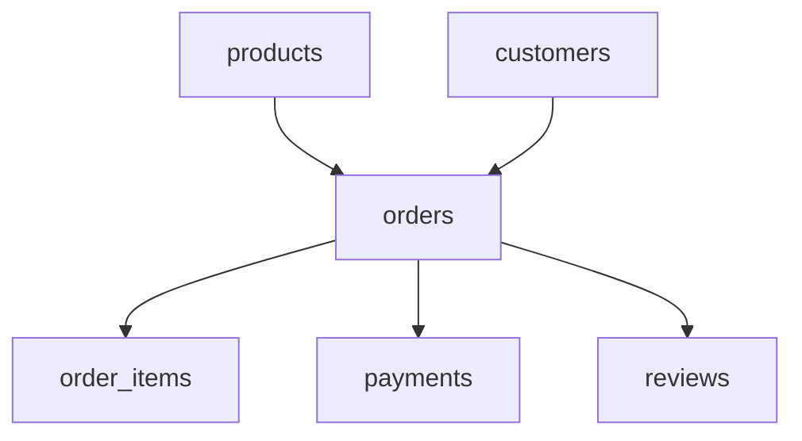
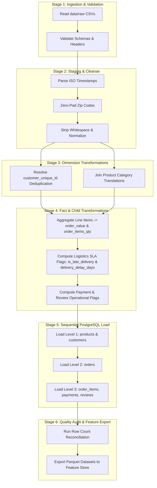

# ETL Execution Plan - Customer Intelligence Platform

This document defines the production execution strategy, stage dependency graph, error handling protocols, performance optimizations, and architectural modularity for the **Customer Intelligence Platform** ETL pipeline.

---

## 1. Pipeline Stages Overview

The ETL pipeline operates across six distinct sequential stages:

```text
[Stage 1: Ingestion & Validation] ──> [Stage 2: Staging & Cleanse] ──> [Stage 3: Dimension Transformations]
                                                                                      │
[Stage 6: Quality Audit & Feature Store] <── [Stage 5: Relational Load] <── [Stage 4: Fact & Child Transformations]
```

1. **Stage 1: Ingestion & Raw Validation**: Reads raw CSV files from `data/raw`, validates file headers, checks encoding, and verifies row counts.
2. **Stage 2: Staging & Data Cleansing**: Normalizes data types, pads zip code prefixes, parses ISO timestamps, strips whitespace, and handles missing/null values.
3. **Stage 3: Dimension Transformations**: Executes lookup joins and identity resolution (resolving `customer_unique_id` and category English translation).
4. **Stage 4: Fact & Child Transformations**: Computes pre-calculated operational metrics (`order_value`, `delivery_delay_days`, `has_comment_message`, etc.) and performs dataset aggregations.
5. **Stage 5: Relational Database Loading**: Bulk-inserts transformed data into PostgreSQL in strict foreign-key dependency order using database transactions.
6. **Stage 6: Data Quality Audit & Feature Store Export**: Reconciles target table row counts, verifies referential integrity, and exports aggregated offline feature datasets.

---

## 2. Dependency Graph & Loading Order

To enforce PostgreSQL foreign key integrity constraints, data MUST be loaded into the database according to the following strict sequential hierarchy:



### Table Loading Execution Sequence

1. **Level 1 (Independent Parent Entities)**:
   - `products` (Zero foreign key dependencies)
   - `customers` (Zero foreign key dependencies after identity resolution)
2. **Level 2 (Primary Transaction Entity)**:
   - `orders` (Depends on `customers`)
3. **Level 3 (Dependent Child Entities)**:
   - `order_items` (Depends on `orders` and `products`)
   - `payments` (Depends on `orders`)
   - `reviews` (Depends on `orders`)

---

## 3. CSV Processing Independence Analysis

### Independent CSV Files (Can be processed in parallel)
- `olist_products_dataset.csv`
- `product_category_name_translation.csv`
- `olist_customers_dataset.csv`
- `olist_order_payments_dataset.csv`
- `olist_order_reviews_dataset.csv`

### Dependent CSV Files (Require prior stage data)
- `olist_orders_dataset.csv`: Requires `olist_customers_dataset.csv` to map order `customer_id` to master `customer_unique_id`.
- `olist_order_items_dataset.csv`: Requires `olist_orders_dataset.csv` for order validation and `olist_products_dataset.csv` for product key verification.

---

## 4. Join Specifications

| Target Entity | Primary CSV | Joined CSV | Join Key | Join Type | Purpose |
| :--- | :--- | :--- | :--- | :--- | :--- |
| **`products`** | `olist_products_dataset.csv` | `product_category_name_translation.csv` | `product_category_name` | `LEFT JOIN` | Translates Portuguese category names to English (`category_name_english`). |
| **`orders`** | `olist_orders_dataset.csv` | `olist_customers_dataset.csv` | `customer_id` | `INNER JOIN` | Maps order-level customer hash to persistent `customer_unique_id`. |
| **`customers`** | `olist_customers_dataset.csv` | `olist_orders_dataset.csv` | `customer_id` | `LEFT JOIN` | Derives earliest order timestamp to determine account creation date (`created_at`). |

---

## 5. Aggregation Specifications

| Target Entity | Metric Column | Source Table | Aggregation Logic | Purpose |
| :--- | :--- | :--- | :--- | :--- |
| **`orders`** | `order_items_qty` | `olist_order_items_dataset` | `COUNT(order_item_id) GROUP BY order_id` | Pre-calculates line item count. |
| **`orders`** | `total_items_price` | `olist_order_items_dataset` | `SUM(price) GROUP BY order_id` | Pre-calculates itemized revenue sum. |
| **`orders`** | `total_freight_value` | `olist_order_items_dataset` | `SUM(freight_value) GROUP BY order_id` | Pre-calculates total order shipping fee. |
| **`orders`** | `order_value` | `olist_order_items_dataset` | `total_items_price + total_freight_value` | Pre-calculates gross order value. |
| **`customers`** | `created_at` | `olist_orders_dataset` | `MIN(order_purchase_timestamp) GROUP BY customer_unique_id` | Sets customer account registration date. |

---

## 6. Error Handling Strategy

1. **Dead Letter Queue (DLQ) & Quarantine**: Malformed or invalid rows (e.g. invalid date formats, unparseable floats) are routed to a `data/quarantine/` directory and logged in an `etl_quarantine_log` table without halting the pipeline.
2. **Threshold Circuit Breaker**: If error volume on any single dataset exceeds **5% of total row count**, the execution pipeline triggers an automatic circuit breaker and aborts to prevent corrupt database states.
3. **Foreign Key Integrity Safeguard**: Orphaned child records (e.g. `order_items` referencing non-existent `order_id`) are quarantined before database loading.

---

## 7. Logging Strategy

1. **Structured JSON Logs**: Uses `Loguru` to format logs as structured JSON containing `timestamp`, `execution_id`, `stage`, `dataset`, `processed_rows`, `quarantined_rows`, and `duration_ms`.
2. **Pipeline Execution Audit Table**: Log metadata is written to `etl_batch_jobs` in PostgreSQL upon completion:
   - `job_id`, `status` (`SUCCESS`/`FAILED`), `start_time`, `end_time`, `rows_ingested`, `rows_quarantined`.

---

## 8. Retry Strategy

1. **Transient DB Failure Retry**: Uses exponential backoff (base 2 seconds, maximum 3 attempts) for database connection timeouts or transient locking issues.
2. **Idempotent Loading**: Uses `ON CONFLICT (id) DO UPDATE` or staging table swaps to ensure re-running the pipeline does not create duplicate entries or cause key collision errors.

---

## 9. Performance Optimizations

1. **PostgreSQL Bulk Loading (`COPY`)**: Replaces row-by-row `INSERT` queries with PostgreSQL binary `COPY` protocol via `asyncpg`, achieving loading speeds exceeding 50,000 rows/second.
2. **Parallel Stage Execution**: Independent dimension processing (e.g., `products` and `customers` transformation) runs concurrently using Python `asyncio` worker pools.
3. **Vectorized Transformations**: Data cleansing and date parsing leverage vectorized Pandas/Polars operations.

---

## 10. Batch Processing Strategy

- **Micro-Batch Processing**: Processes data in chunks of **10,000 records** to control memory footprint and maintain low RAM consumption (< 512 MB memory threshold).
- **Generator Pipelines**: Data is streamed iteratively through memory rather than loaded entirely as a single monolithic dataframe.

---

## 11. Folder Structure for ETL Modules

```text
app/
├── etl/
│   ├── __init__.py
│   ├── pipeline.py              # Main ETL orchestrator entry point
│   ├── extract/
│   │   ├── __init__.py
│   │   ├── csv_loader.py         # CSV file reader with encoding detection
│   │   └── raw_validators.py     # Schema and header validation
│   ├── transform/
│   │   ├── __init__.py
│   │   ├── transform_customers.py # Customer identity resolution & cleaning
│   │   ├── transform_products.py  # Category translation & volumetric calc
│   │   ├── transform_orders.py    # Order status flags & SLA delay calcs
│   │   ├── transform_items.py     # Order item cost calculations
│   │   ├── transform_payments.py  # Payment split & installment flags
│   │   └── transform_reviews.py   # Review comment flags & rating checks
│   ├── load/
│   │   ├── __init__.py
│   │   ├── bulk_loader.py        # asyncpg binary COPY bulk insert engine
│   │   └── db_transactions.py    # PostgreSQL transaction wrapper
│   └── utils/
│       ├── __init__.py
│       ├── etl_logger.py         # Structured Loguru setup
│       └── dlq_handler.py        # Quarantine and DLQ writer
```

---

## 12. Unit Testing Strategy

1. **Validator Tests**: Verify Pydantic schema rejection for invalid data types or malformed strings.
2. **Transformation Logic Tests**:
   - Test zip code 5-digit zero-padding (`1310` $\rightarrow$ `'01310'`).
   - Test delivery delay calculation (`delivered_date > estimated_date`).
   - Test missing category translation fallback to `'Uncategorized'`.
3. **Integration & Loading Tests**: Run pipeline against a test PostgreSQL container using Testcontainers to verify constraint integrity and bulk load execution.

---

## 13. Expected Outputs After Every Stage

| Pipeline Stage | Input Artifact | Output Artifact / Target | Expected Row Output | Success Criteria |
| :--- | :--- | :--- | :--- | :--- |
| **Stage 1: Ingestion** | `data/raw/*.csv` | In-Memory Raw DataFrames | 9 Raw DataFrames | File signatures, headers, and encodings verified. |
| **Stage 2: Staging** | Raw DataFrames | Cleaned Staging DataFrames | 9 Staging DataFrames | Datatypes cast, dates parsed, zero-padded zip codes. |
| **Stage 3: Dimensions** | Staged Customers & Products | Refined `customers` & `products` | 96,096 Customers; 32,951 Products | Deduplicated customers; English category translations joined. |
| **Stage 4: Facts** | Staged Orders, Items, Reviews, Payments | Refined `orders`, `items`, `payments`, `reviews` | 99,441 Orders; 112,650 Items; 103,886 Payments; 99,224 Reviews | Operational metrics computed (`order_value`, SLA flags). |
| **Stage 5: Relational Load** | Transformed DataFrames | PostgreSQL Tables | 6 Database Tables Populated | All PK/FK constraints passed; zero orphan records. |
| **Stage 6: Audit** | PostgreSQL Tables | `data/feature_store/*.parquet` | Parquet Feature Datasets | 100% row count reconciliation; zero integrity errors. |

---

## 14. Mermaid Pipeline Flowchart


