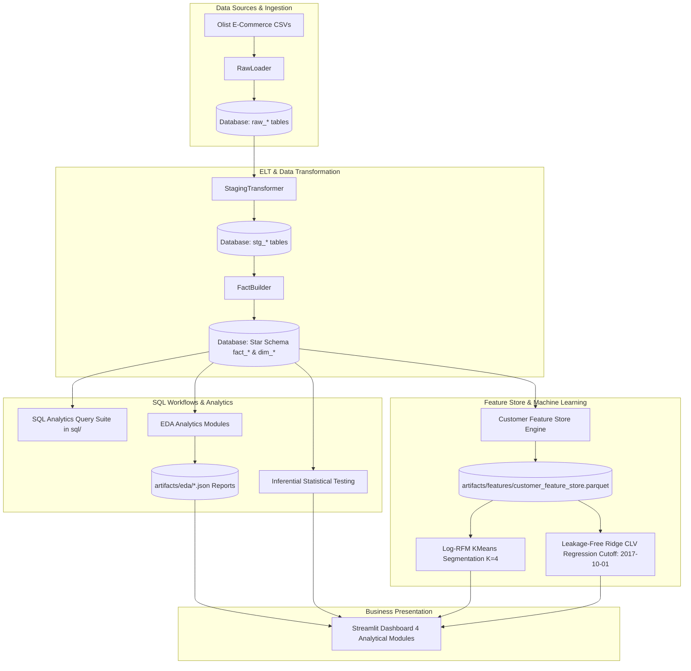

# Customer Intelligence & E-Commerce Analytics — Comprehensive Final Project Walkthrough

Welcome to the **Customer Intelligence & E-Commerce Analytics** comprehensive architectural and operational walkthrough. This document details the end-to-end data pipeline flow, relational data transformations, analytical SQL query suite, inferential statistics, customer feature store engineering, machine learning model architectures, and the 4-module Streamlit analytics application.

---

## 1. End-to-End System Architecture

The Customer Intelligence & E-Commerce Analytics platform is structured into 5 core operational layers:

---

## 2. ELT & Data Pipeline

The ELT pipeline transforms raw e-commerce CSV files into clean dimensional star schemas, supporting analytical SQL workflows.

---

## 3. SQL Analytics Workflows

The repository contains 6 SQL analytics scripts in `sql/`:
1. `01_customer_rfm_analytics.sql`: Recency, Frequency, Monetary calculations using CTEs and `NTILE(4)`.
2. `02_monthly_revenue_mom_growth.sql`: Financial MoM growth using `LAG() OVER()` and cumulative revenue using `SUM() OVER()`.
3. `03_cohort_retention_matrix.sql`: 12-Month acquisition cohort retention matrix using date truncation and month-by-month joins.
4. `04_seller_revenue_pareto.sql`: 80/20 Pareto seller concentration analysis using window functions and percentile binning.
5. `05_delivery_sla_state_performance.sql`: Regional carrier delivery SLA breach analysis and state-level delay metrics.
6. `06_data_quality_order_status_audit.sql`: Revenue reconciliation across order statuses ($16.01M GMV vs $13.59M Net Revenue across 99,441 orders).

---

## 4. Inferential Statistical Analysis

SciPy non-parametric hypothesis testing:
- **Mann-Whitney U Test**: Evaluates delivery delays vs star ratings ($U = 152,455,891.5, p < 0.0001, r = 0.5534$), finding a statistically significant association with a 1.72-star rating penalty.
- **Kruskal-Wallis H Test**: Confirms significant delivery delay variation across Brazilian customer states ($H = 268.4, p < 0.0001$).

---

## 5. Machine Learning Models

- **Customer Segmentation**: Unsupervised Log-RFM KMeans ($K=4$, Calinski-Harabasz: 66,767.45).
- **Customer Lifetime Value**: Temporal Ridge Regression (MAE \$7.27, Median AE \$3.44) using strict observation cutoff `2017-10-01`.

---

## 6. Streamlit Dashboard Application

4 consolidated story-driven analytical pages:
1. **Executive Overview (`1_Executive_Overview.py`)**: Financial KPIs, GMV reconciliation, order status audit, monthly trajectory.
2. **Customer & Sales Analytics (`2_Customer_&_Sales_Analytics.py`)**: 12-Month acquisition cohort retention heatmap (<3.12% Month-1 retention), seller 80/20 Pareto concentration (82.69% top-20% revenue share), Log-RFM customer personas.
3. **Logistics & Statistical Analysis (`3_Logistics_&_Statistical_Analysis.py`)**: Delivery SLA performance, 1.72-star rating penalty, Mann-Whitney U & Kruskal-Wallis test cards.
4. **Predictive Analytics (`4_Predictive_Analytics.py`)**: Cutoff methodology (`2017-10-01`), Ridge CLV Regression (\$7.27 MAE), feature weights, real-time score lookup.
