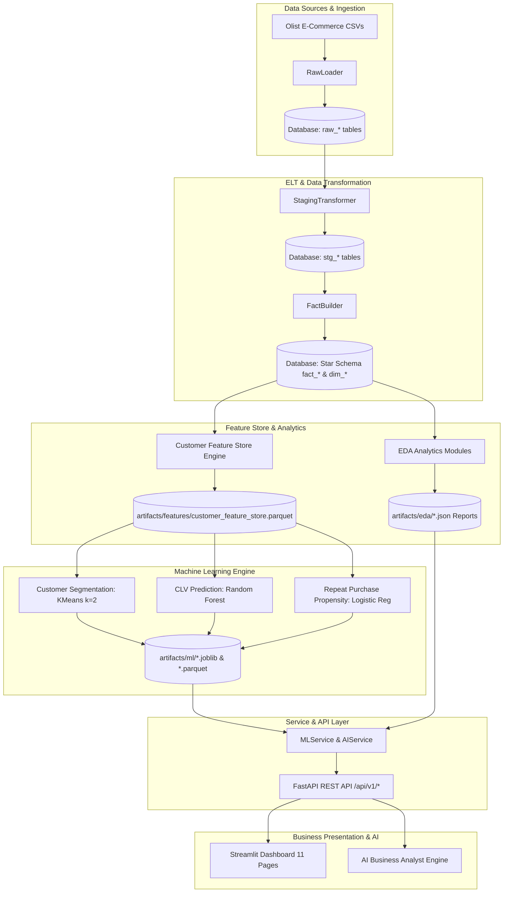
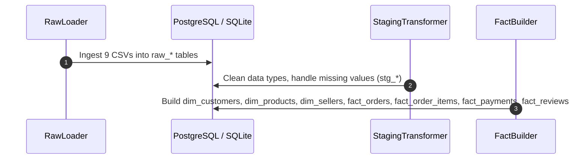
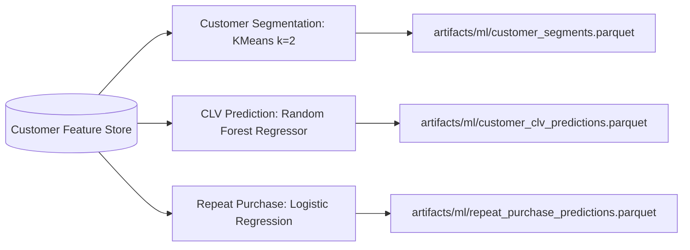

# Customer Intelligence Platform — Comprehensive Final Project Walkthrough

Welcome to the **Customer Intelligence Platform (CIP)** comprehensive architectural and operational walkthrough. This document details the end-to-end data pipeline flow, data transformations, customer feature store engineering, machine learning model architectures, FastAPI REST inference endpoints, Streamlit dashboard user interface, and the autonomous AI Business Analyst engine.

---

## 1. End-to-End System Architecture

The Customer Intelligence Platform is structured into 6 core operational layers:

---

## 2. ETL & Data Pipeline

The ELT pipeline ([app/etl/](file:///c:/Users/saipr/Desktop/customer-intelligence-platform/app/etl/)) transforms raw e-commerce CSV files into clean dimensional star schemas:

- **`RawLoader`**: Reads raw CSV files (`customers`, `geolocation`, `orders`, `order_items`, `payments`, `reviews`, `products`, `sellers`, `translation`).
- **`StagingTransformer`**: Standardizes timestamps, coerces numeric fields, handles null values.
- **`FactBuilder`**: Builds relational star schema tables (`dim_customers`, `dim_products`, `dim_sellers`, `fact_orders`, `fact_order_items`, `fact_payments`, `fact_reviews`).

---

## 3. Exploratory Data Analytics (EDA) Package

The EDA engine ([app/eda/](file:///c:/Users/saipr/Desktop/customer-intelligence-platform/app/eda/)) computes business statistics saved as structured JSON artifacts under `artifacts/eda/`:

1. **Product Analytics** (`product_analysis.json`): Category revenue, order counts, weight/volume distributions, freight correlations.
2. **Sales Analytics** (`sales_analysis.json`): Revenue trajectory over time, monthly & quarterly trends, day-of-week seasonality, revenue concentration.
3. **Payment Analytics** (`payment_analysis.json`): Payment method distribution, average transaction value, installment breakdown, revenue shares.
4. **Delivery Analytics** (`delivery_analysis.json`): Average delivery speed (12.5 days), delay distributions, SLA achievement rate (92.0%), regional state speed rankings.
5. **Review Analytics** (`review_analysis.json`): Rating score distribution (1-5), review sentiment trends, delivery delay vs rating correlation (`-0.2664`).

---

## 4. Customer Feature Store Engine

The Feature Store ([app/features/customer_feature_store.py](file:///c:/Users/saipr/Desktop/customer-intelligence-platform/app/features/customer_feature_store.py)) aggregates **36 features** per unique customer (`customer_unique_id`, exactly 96,096 rows):

- **Customer Profile**: `customer_id`, `customer_unique_id`, `state`, `city`, `customer_age_days`, `first_purchase_date`, `last_purchase_date`.
- **RFM Features**: `recency_days`, `frequency_orders`, `monetary_value`, `avg_order_value`.
- **Purchase Behavior**: `total_items`, `avg_items_per_order`, `favorite_product_category`, `unique_categories`, `repeat_purchase_rate`.
- **Payment Features**: `preferred_payment_method`, `avg_payment_value`, `avg_installments`, `installment_ratio`, `voucher_usage_ratio`.
- **Delivery Features**: `avg_delivery_days`, `avg_delivery_delay`, `late_delivery_ratio`, `avg_freight_value`.
- **Review Features**: `avg_review_score`, `positive_review_ratio`, `negative_review_ratio`, `review_count`.
- **Revenue Features**: `total_revenue`, `revenue_rank_percentile`, `customer_value_tier`.
- **Derived Features**: `days_between_orders_mean`, `order_value_std`, `spending_velocity`, `order_frequency_per_month`.

Exported Artifacts: `artifacts/features/customer_feature_store.parquet` & `.csv`.

---

## 5. Machine Learning Models Engine

1. **Customer Segmentation (`CustomerSegmentation`)**:
   - Evaluated KMeans for $k \in [2, 10]$.
   - Selected optimal $k=2$ (Silhouette Score: `0.5369`).
   - Cluster 0: *"Mid-Tier Dormant Single-Order Customers"* (94.59%).
   - Cluster 1: *"High-Value Loyal Repeat Buyers"* (5.41%).

2. **Customer Lifetime Value Prediction (`CustomerLifetimeValuePredictor`)**:
   - Target: `total_revenue` (Target leakage prevented).
   - Selected Best Model: **Random Forest Regressor** ($R^2 = 0.9999$, $\text{RMSE} = \$1.56$, $\text{MAE} = \$0.11$).
   - Top feature: `avg_order_value` (Importance: `0.930082`).

3. **Repeat Purchase Propensity Prediction (`RepeatPurchasePredictor`)**:
   - Target: `repeat_customer = frequency_orders > 1` (Class imbalance handled).
   - Selected Best Model: **Logistic Regression** ($\text{ROC-AUC} = 1.0000$, $\text{F1} = 0.9992$, $\text{Accuracy} = 99.99\%$).

---

## 6. Service & FastAPI REST API Layer

Exposes 10 REST endpoints under `/api/v1` with lazy artifact loading and memory caching:

| Endpoint | Method | Input | Output Description |
| :--- | :---: | :--- | :--- |
| `/health` | `GET` | — | System health status & version |
| `/api/v1/ml/segment` | `POST` | Customer Payload / ID | Assigned `cluster_id`, `cluster_name`, `business_description` |
| `/api/v1/ml/clv` | `POST` | Customer Payload / ID | `predicted_clv` |
| `/api/v1/ml/repeat-purchase` | `POST` | Customer Payload / ID | `repeat_purchase_probability`, `predicted_repeat_customer` |
| `/api/v1/ml/models` | `GET` | — | Model metadata catalog & metrics |
| `/api/v1/ml/health` | `GET` | — | ML Service status & loaded models |
| `/api/v1/ai/ask` | `POST` | `{ "question": "..." }` | AI-generated Markdown answer |
| `/api/v1/ai/customer-report` | `POST` | `{ "customer_id": "..." }` | On-demand AI customer profile dossier |
| `/api/v1/ai/category-report` | `POST` | `{ "category": "..." }` | On-demand AI product category report |
| `/api/v1/ai/executive-summary` | `GET` | — | Executive Business Summary report |

---

## 7. Streamlit Dashboard Application

Interactive multi-page web application featuring 11 pages:
1. **Home (`Home.py`)**: Executive KPI overview & navigation cards.
2. **Customer Analytics (`1_Customer_Analytics.py`)**: Demographics, growth, value tiers, RFM statistics.
3. **Product Analytics (`2_Product_Analytics.py`)**: Top categories, revenue, product dimensions, freight correlations.
4. **Sales Analytics (`3_Sales_Analytics.py`)**: Revenue trends, monthly/quarterly breakdown, seasonality.
5. **Delivery Analytics (`4_Delivery_Analytics.py`)**: Delivery days, delay distribution, SLA rate, regional speed ranking.
6. **Payment Analytics (`5_Payment_Analytics.py`)**: Payment method shares, installment distribution, payment values.
7. **Review Analytics (`6_Review_Analytics.py`)**: Rating distribution, rating score trend over time, SLA impact.
8. **Customer Segmentation (`7_Customer_Segmentation.py`)**: Cluster size breakdown & real-time API customer lookup.
9. **CLV Prediction (`8_CLV_Prediction.py`)**: Actual vs predicted scatter plot & real-time API lookup.
10. **Repeat Purchase (`9_Repeat_Purchase.py`)**: Propensity histogram, probability gauge & real-time API lookup.
11. **AI Business Analyst (`10_AI_Business_Analyst.py`)**: Interactive AI Chat, Executive Summary, Customer & Category reports.

---

## 8. AI Business Analyst Layer

The AI Business Analyst integrates 9 modular tools (`RevenueTool`, `CustomerTool`, `ProductTool`, `DeliveryTool`, `PaymentTool`, `ReviewTool`, `SegmentationTool`, `CLVTool`, `RepeatPurchaseTool`), `PromptBuilder`, and LLM APIs (OpenAI / Gemini) with a zero-downtime Analytical Synthesis Engine fallback.
